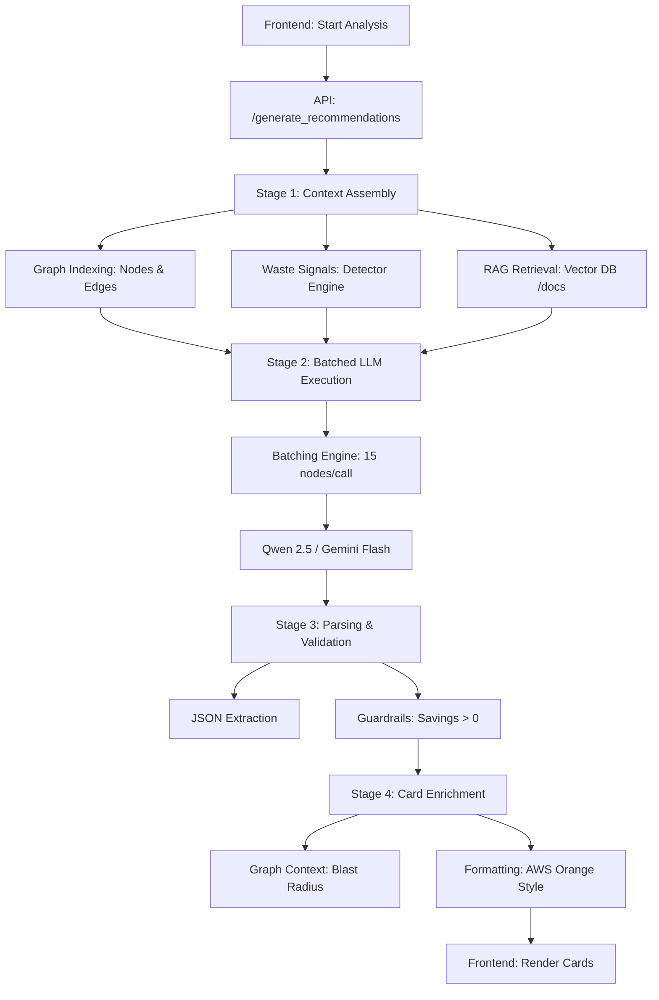

# Workflow Detailed: LLM Proposed Cards Generation

Ce document détaille le cycle de vie complet de la génération des recommandations FinOps (les "Proposed Cards") au sein de la plateforme.

## 1. Architecture Globale du Pipeline

Le processus suit une approche **Grounding-First**, s'assurant que chaque recommandation générée par l'IA est ancrée dans des données réelles (coûts, graphe d'architecture, et meilleures pratiques).

---

## 2. Étapes Détaillées

### Étape 1 : Assemblage du Contexte (Context Assembly)
Avant d'interroger l'LLM, le système construit un "package de contexte" ultra-dense :
- **Inventory & Cost**: Liste exacte des ressources avec leurs coûts mensuels réels.
- **Waste Signals**: Résultats des détecteurs déterministes (ex: logs non expirés, images ECR orphelines).
- **RAG (Retrieval Augmented Generation)**: Recherche sémantique dans les fichiers `/docs` via **pgvector** pour extraire les stratégies FinOps pertinentes au type de services détectés.
- **Graph Dependencies**: Calcul des liens critiques pour évaluer l'impact (blast radius) de chaque modification.

### Étape 2 : Exécution par Lots (Batched Pipeline)
Pour gérer des architectures de production massives sans temps d'attente excessifs (optimisé pour **Qwen 2.5**) :
- Les services sont divisés en **lots de 15**.
- Chaque lot reçoit le système de prompt haute-densité incluant les catégories d'optimisation (Compute, Storage, Database, etc.).
- Le traitement est séquentiel pour garantir la stabilité de l'inference locale (Ollama).

### Étape 3 : Parsing et Validation (Guardrails)
Le système extrait le JSON brut de la réponse LLM et applique des filtres de sécurité :
- **Filtre de Coût**: Les économies estimées doivent être supérieures à 0.
- **Filtre de Réalisme**: Les économies ne peuvent pas dépasser le coût actuel de la ressource.
- **Banned Actions**: Suppression des recommandations vagues (ex: "Review", "Monitor") pour ne garder que des actions concrètes ("Rightsize", "Delete", "Migrate").

### Étape 4 : Enrichissement des Cartes (Enrichment)
Chaque recommandation brute est transformée en une "Rich Card" :
- **Impact Analysis**: Utilisation du graphe pour calculer l'impact sur les dépendances.
- **CLI Remediation**: Génération ou validation des commandes de remédiation technique.
- **Pourquoi c'est important**: Ajout d'une justification métier basée sur le contexte architectural.

---

## 3. Configuration de Performance (Qwen 2.5)

Pour les architectures de grade "Production", les paramètres suivants sont appliqués :
- **Context Window**: 128k tokens pour éviter toute troncature du contexte RAG.
- **Batch Size**: 15 ressources par appel LLM.
- **Output Budget**: 40,000 tokens pour des rapports exhaustifs.
- **Timeout**: 15 minutes par lot pour les analyses profondes.

## 4. Format de Sortie (Frontend)
Les cartes sont envoyées au frontend sous un format JSON normalisé, permettant un rendu homogène avec le style **AWS Orange Console**, incluant :
- Titre formaté AI personnalisé.
- Sévérité (Low, Medium, High, Critical).
- Économies mensuelles précises.
- Badge de complexité de mise en œuvre.
